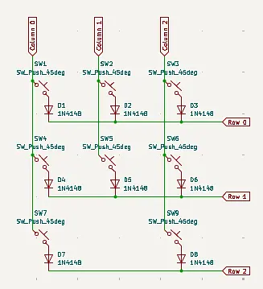
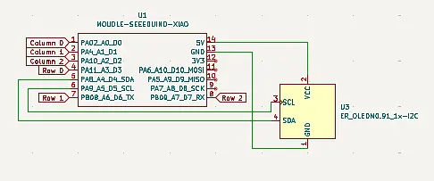
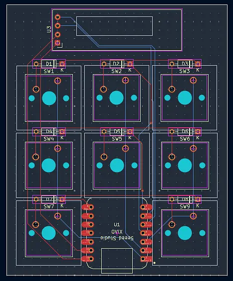
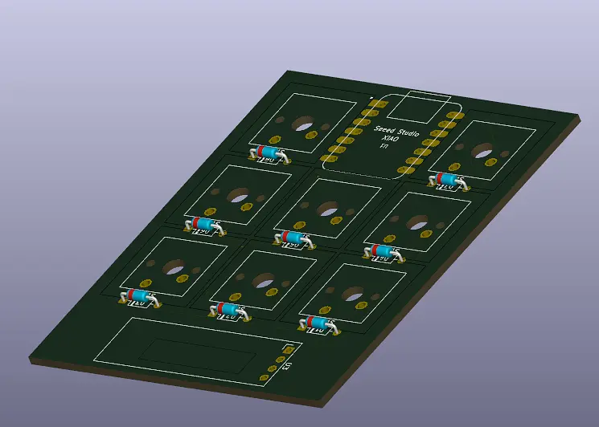
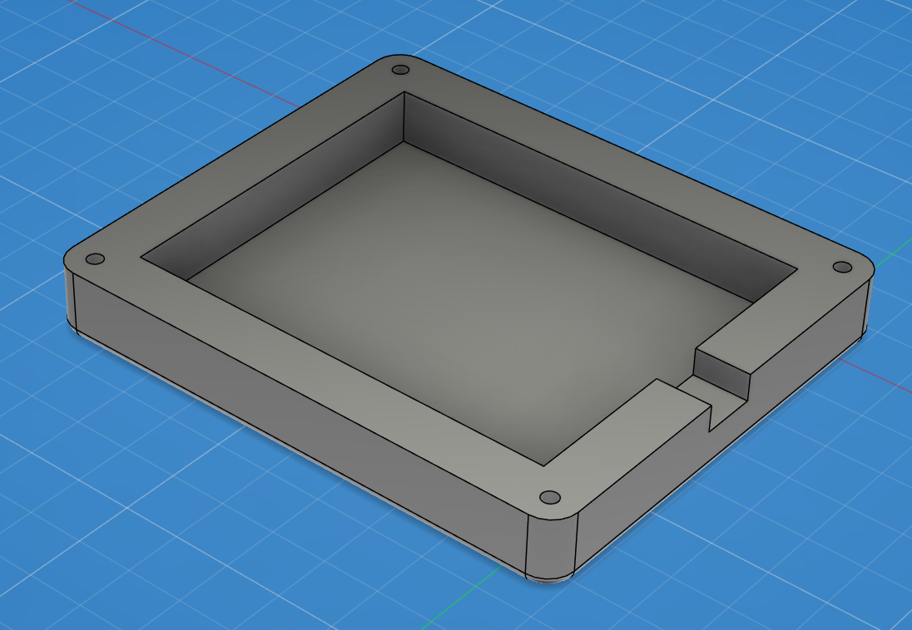
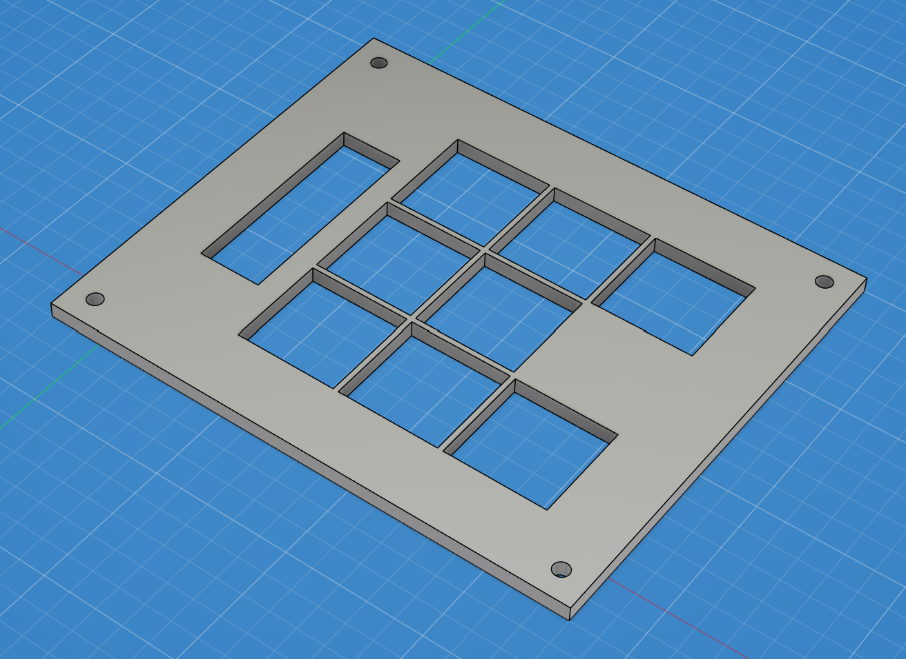

# Copy-Paste-Pad
a Short Keyboard with **8 Keys**, **8 Diodes**, a small **OLED screen** and an [**Seeed XIAO RP2040**](https://wiki.seeedstudio.com/XIAO-RP2040/) on board. Developed for the purpose of unlocking the possibility to store up to 6 different Texts or other Things inside the memory, while keeping an overview and controlled usage of the stored elements.

## Schematic & PCB
The Board was deisgned in KiCAD as first of this kind experience for myself and included the mentioned [**Seeed XIAO RP2040**](https://wiki.seeedstudio.com/XIAO-RP2040/). There i connected the **8 Keys** and theire **8 Diodes** inside a *3 x 3* Key Matrix, as shown in a youtube tutorial by [ai03](https://wiki.ai03.com/books/pcb-design).

Apart from that i Added as wel a **OLED screen** to show wheather the Keyboard is currently in a ***Copy*** or a ***Paste*** state or if both false, in an displaying state. The OLED Screen is currently wired with the *5V* output of the [**Seeed XIAO RP2040**](https://wiki.seeedstudio.com/XIAO-RP2040/), but might be later reduced to the *3.3V* output. Apart from that its wired with the *GNU* which i learned, is to remove electicity from components, so the opposit of the Voltage outputs. Last but not Least is the **OLED screen** wired with the *SDA* and *SCL* pins.

In The following you can than see the finished **PCB** inside KiCAD, as well as its **3D Rendering**. Sadly i wasnt able to render the [**Seeed XIAO RP2040**](https://wiki.seeedstudio.com/XIAO-RP2040/) and the **8 Keys**, but at least the **8 Diodes** -_- .

## CAD / Casing
The Casing is one of the most important things of an Keyboard, as it determines wheather a Product will be loved or hated by an Community. but anyways did i keep a relativly ***simple*** design with rounded edges and a simple but effectiv order of the different **keys** and the **OLED screen**. In the following you can see first, the Bottom of the Casing, and after that the top, which later on will get fixed into the bottom half.

