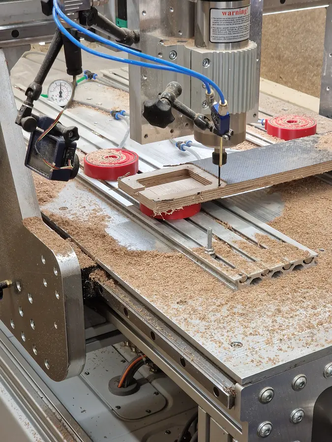
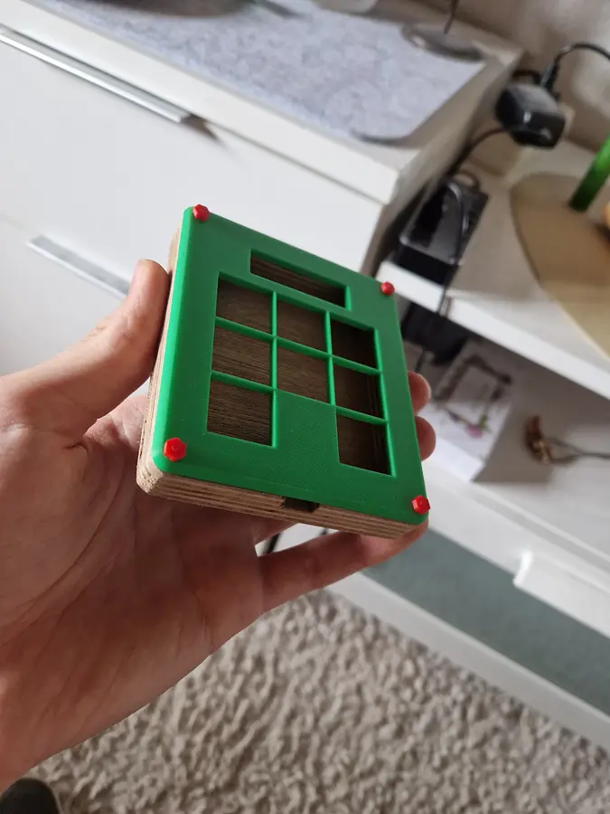

# Copy-Paste-Pad
a Short Keyboard with **8 Keys**, **8 Diodes**, a small **OLED screen** and an [**Seeed XIAO RP2040**](https://wiki.seeedstudio.com/XIAO-RP2040/) on board. Developed for the purpose of unlocking the possibility to store up to 6 different Texts or other Things inside the memory, while keeping an overview and controlled usage of the stored elements.

## Schematic & PCB
The Board was deisgned in KiCAD as first of this kind experience for myself and included the mentioned [**Seeed XIAO RP2040**](https://wiki.seeedstudio.com/XIAO-RP2040/). There i connected the **8 Keys** and theire **8 Diodes** inside a *3 x 3* Key Matrix, as shown in a youtube tutorial by [ai03](https://wiki.ai03.com/books/pcb-design).

Apart from that i Added as wel a **OLED screen** to show wheather the Keyboard is currently in a ***Copy*** or a ***Paste*** state or if both false, in an displaying state. The OLED Screen is currently wired with the *5V* output of the [**Seeed XIAO RP2040**](https://wiki.seeedstudio.com/XIAO-RP2040/), but might be later reduced to the *3.3V* output. Apart from that its wired with the *GNU* which i learned, is to remove electicity from components, so the opposit of the Voltage outputs. Last but not Least is the **OLED screen** wired with the *SDA* and *SCL* pins.

In The following you can than see the finished **PCB** inside KiCAD, as well as its **3D Rendering**. Sadly i wasnt able to render the [**Seeed XIAO RP2040**](https://wiki.seeedstudio.com/XIAO-RP2040/) and the **8 Keys**, but at least the **8 Diodes** -_- .

## CAD / Casing
The Casing is one of the most important things of an Keyboard, as it determines wheather a Product will be loved or hated by an Community. but anyways did i keep a relativly ***simple*** design with rounded edges and a simple but effectiv order of the different **keys** and the **OLED screen**. In the following you can see first, the Bottom of the Casing, and after that the top, which later on will get fixed into the bottom half.

as wood is a great material, appearing in high quality and therefore more professional i as well created the entire ***bottom half*** of the casing as **.dxf** just as the ***top part***, which unfortunatly could just be made by a laser, as a CNC machine would struggle with the fine borders beetwheen each key switch.

## Firmware
besides all the hardware, the firmware is what makes a product standing out from others, therefore the mission was clear. 1 key to activate the so called *copying mode*, one other key to activate the *pasting mode*. both of which would **stay active** until you decide to deactivate them.

so the only remaining thing would be to press the wanted key switch for the different (out of **6**) clipboards.

to achieve this the keyboard needs both, a **own firmware**. as well as a **.exe Application** running on the PC himself to performe all the Copying and Pasting things the keyboard itself isnt allowed.

### QMK
the QMK firmware consists of the [v1](./Firmware/copy_paste_board/keymaps/v1/) keymap, presenting almost every smart thing and function in general provided by the keyboard. this gets underlined by the [rules](./Firmware/copy_paste_board/rules.mk) set to make working with **hid** (human interface device) and the **OLED screen** possible.

Last but not least is there the [keyboard info](./Firmware/copy_paste_board/keyboard.json) providing every basic information about the producer, its components and the **key matrix**, consisting of **Rows** and **Columns**

### Windows Application
the Womdpws Application in form of an **.exe** is where the fun begins. it gets **hid** (human interface device) signals by the QMK firmware, telling it what action to performe.

Whether its **Copying**, **Pasting** or just doing nothing, the **hid** is the source of decision.

to prevent the user from having to start this Script each time they start their PCs, it is so smart that it writes itself into the **Auto start** after the *first* execution of itself. making it possible to use the keyboard without any action.